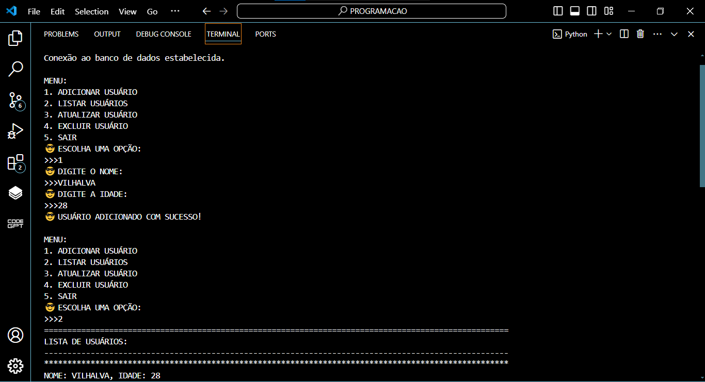
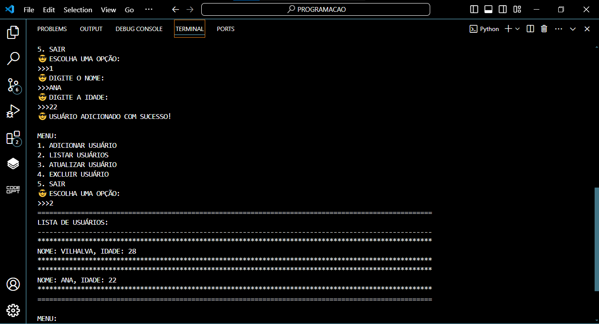
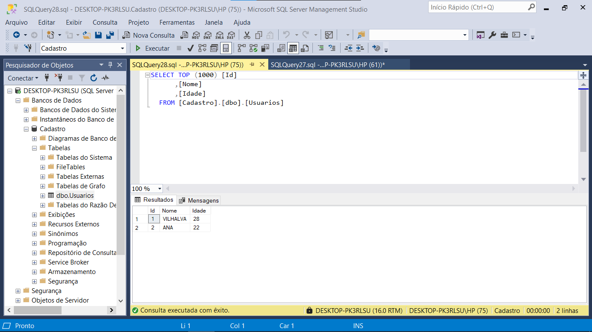

# CRUD RUST EM SQL SERVER
🎈GERENCIE O NOME E IDADE DOS USUÁRIOS NA DATABASE SQL SERVER.

 <br>
 <br>
 <br>

## DESCRIÇÃO:
Este aplicativo é um gerenciador de usuários que permite adicionar, listar, atualizar e excluir informações de usuários armazenadas em um banco de dados SQL SERVER CRUD. Ele foi projetado para fornecer uma interface simples e interativa para manipular os dados dos usuários.

Funcionalidades principais:

1. **Adicionar Usuário**: Permite adicionar um novo usuário ao banco de dados, fornecendo o nome e a idade do mesmo.

2. **Listar Usuários**: Apresenta uma lista de todos os usuários cadastrados no banco de dados, mostrando seus nomes e idades.

3. **Atualizar Usuário**: Permite atualizar as informações de um usuário existente no banco de dados, substituindo o nome e/ou a idade pelo novo valor fornecido.

4. **Excluir Usuário**: Remove um usuário específico do banco de dados com base no nome fornecido.

O aplicativo fornece um menu intuitivo para o usuário interagir com essas funcionalidades. Ele utiliza a linguagem de programação Rust e o conector SQL SERVER para estabelecer a conexão com o banco de dados e executar as operações de manipulação de dados.

Essa aplicação é útil em cenários onde é necessário armazenar e gerenciar informações de usuários de forma eficiente, como em sistemas de cadastro, administração de usuários em plataformas web, entre outros.

## EXECUTANDO O PROJETO:
1. **Importar o Banco de Dados**:
   - Antes de executar o aplicativo, importe o arquivo `./CODIGO/DATABASE.sql` fornecido para o seu banco de dados SQL SERVER. 

2. **Configuração da Conexão do Banco de Dados**:
   - Abra o arquivo `./CODIGO/src/main.rs` e localize a seção onde a conexão com o banco de dados é configurada.
   - Se você utiliza autenticação do Windows, insira o seguinte trecho de código para configurar a conexão:
   ```rust
   let conn = env.connect_with_connection_string(
            "DRIVER={ODBC Driver 17 for SQL Server};SERVER=DESKTOP-PK3RLSU;DATABASE=Cadastro;Trusted_Connection=yes;",
        )?;
   ```

3. **Build do Projeto:**
   - Para compilar o aplicativo para produção, navegue até o Diretório `./CODIGO`, e digite o seguinte comando no Terminal:
     ```bash
     cargo build
     ```

4. **Execução do Projeto:**
   - Para iniciar o aplicativo, digite o seguinte comando no Terminal:
     ```bash
     cargo run
     ```

5. **Interagindo com Aplicativo:**
   1. **Adicionando um Usuário**:
      - Selecione a opção `1`.
      - Digite o nome do usuário e pressione Enter.
      - Digite a idade do usuário e pressione Enter.

   2. **Listando Usuários**:
      - Selecione a opção `2`.
      - O programa exibirá a lista de usuários cadastrados.

   3. **Atualizando um Usuário**:
      - Selecione a opção `3`.
      - Digite o nome do usuário a ser atualizado e pressione Enter.
      - Digite o novo nome do usuário e pressione Enter.
      - Digite a nova idade do usuário e pressione Enter.

   4. **Excluindo um Usuário**:
      - Selecione a opção `4`.
      - Digite o nome do usuário a ser excluído e pressione Enter.

   5. **Saindo do Programa**:
      - Selecione a opção `5`.
      - O programa exibirá uma mensagem de saída e encerrará a execução.

## NÃO SABE?
- Entendemos que para manipular arquivos em muitas linguagens, é necessário possuir conhecimento nessas áreas. Para auxiliar nesse aprendizado, oferecemos cursos gratuitos disponíveis:
* [CURSO DE RUST](https://github.com/VILHALVA/CURSO-DE-RUST)
* [CURSO DE SQL SERVER](https://github.com/VILHALVA/CURSO-DE-SQL-SERVER)
* [CONFIRA MAIS CURSOS](https://github.com/VILHALVA?tab=repositories&q=+topic:CURSO)

## CREDITOS:
- [PROJETO BASEADO NO "CRUD PYTHON EM SQL SERVER"](https://github.com/VILHALVA/CRUD-PYTHON-EM-SQL-SERVER)
- [PROJETO FEITO PELO VILHALVA](https://github.com/VILHALVA)


